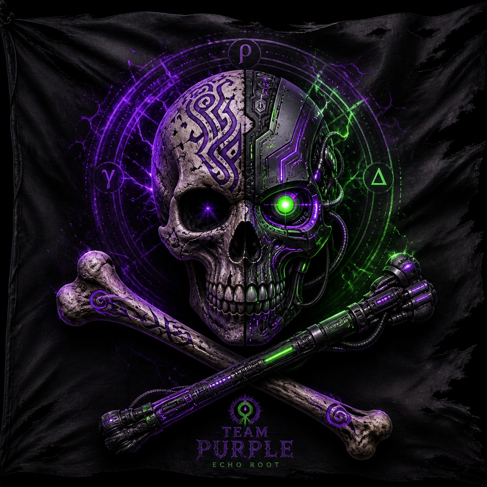

<div align="center">



<br><br>

[](MEMBERS.md)
[](CONTRIBUTING.md)
[]()
[](LICENSE)

<br>

```
Independent builders. Independent ideas. One place.
```

*Not a company. Not a product team. A lab.*

<br>

</div>

---

## 🔬 What This Is

Team PURP is a shared space for independent builders.

Every member has their own project, their own vision, their own timeline.
Nobody answers to the same roadmap.
The only thing shared is the space — and the standard.

Building something real and want a home for it? Read [CONTRIBUTING.md](CONTRIBUTING.md).

---

## 🔒 Independence Statement

Team PURP is a neutral hub for independent builders.
Member projects remain independently owned, named, licensed, and governed.
The lab does not rename, absorb, or represent any project without that builder's explicit consent.

---

## 🗺️ How This Repo Is Structured

```
team-purp/
│
├── README.md               ← you are here — team homepage
├── MEMBERS.md              ← all member profiles in one place
├── JOURNAL.md              ← shared team log (milestones, arrivals, decisions)
├── CONTRIBUTING.md         ← how to join
├── SECURITY.md             ← security policy
├── CHANGELOG.md            ← lab history
├── LICENSE                 ← MIT (hub only — each project has its own)
│
└── members/
    │
    ├── labyrinthcoder/     ← @LabyrinthCoder
    │   ├── PROFILE.md      ← who they are
    │   ├── REPOS.md        ← their active repositories
    │   └── JOURNAL.md      ← their personal build log
    │
    ├── bioankh84/          ← @BioAnkh84
    │   ├── PROFILE.md
    │   ├── REPOS.md
    │   └── JOURNAL.md
    │
    └── new-member-template/   ← copy this to join
        ├── PROFILE.md
        ├── REPOS.md
        ├── JOURNAL.md
        └── README.md
```

**Quick guide:**
- **New here?** Start with this README, then [MEMBERS.md](MEMBERS.md)
- **Want to join?** Read [CONTRIBUTING.md](CONTRIBUTING.md) and copy the template
- **Looking for a specific project?** Check a member's `REPOS.md`
- **Want the full story?** Read a member's `JOURNAL.md`
- **Lab history?** See [JOURNAL.md](JOURNAL.md) and [CHANGELOG.md](CHANGELOG.md)

---

## 🟣 Members

<br>

<div align="center">

[](members/labyrinthcoder/PROFILE.md)

</div>

**Project:** [Labyrinth-OS](https://github.com/LabyrinthCoder/labyrinth-os-core)

Constitutional enforcement substrate for AI systems.
A runtime architecture that enforces accountability between AI cognition and the world —
through Z3-proven formal proofs, tamper-evident ledgers, and a gate that does not negotiate.

> *"Imagination is free. Execution requires proof. No exception."*

[](https://github.com/LabyrinthCoder/labyrinth-os-core)
[]()
[]()
[]()

→ [Profile](members/labyrinthcoder/PROFILE.md) · [Repos](members/labyrinthcoder/REPOS.md) · [Journal](members/labyrinthcoder/JOURNAL.md)

<br>

---

<div align="center">

[](members/bioankh84/PROFILE.md)

</div>

**Project:** [Echo Root VE — Vulpine Echo](https://github.com/BioAnkh84/echo-root-ve)

Trust-gated execution harness for Echo Root OS.
Every execution is decided before it runs. Every decision is recorded.
Nothing executes without gate.
Now evolving toward a fully governed human-AI habitat with real-time observability.

> *"The gate does not negotiate. The ledger does not forget."*

[](https://github.com/BioAnkh84/echo-root-ve)
[]()
[]()

→ [Profile](members/bioankh84/PROFILE.md) · [Repos](members/bioankh84/REPOS.md) · [Journal](members/bioankh84/JOURNAL.md)

<br>

---

<div align="center">

### ＋ Open Slot

[](CONTRIBUTING.md)

*Building something independent? See [CONTRIBUTING.md](CONTRIBUTING.md).*

### ＋ Open Slot &nbsp;&nbsp; ＋ Open Slot

</div>

---

## 📐 The Standard

Projects here are not required to be finished.
They are required to be honest.

Every project in Team PURP can answer:

| Question | Required |
|----------|----------|
| What is this? | ✓ |
| What does it do today? | ✓ |
| What can it not do? | ✓ |
| Where is it going? | ✓ |

---

<div align="center">

<br>

```
The lab is open.
The work is real.
The rest is yours to build.
```

<br>

[](https://x.com/LabyrinthCoder)
[](https://x.com/BioAnkh84)

<br>

*🟣 Team PURP — May 2026*

</div>
